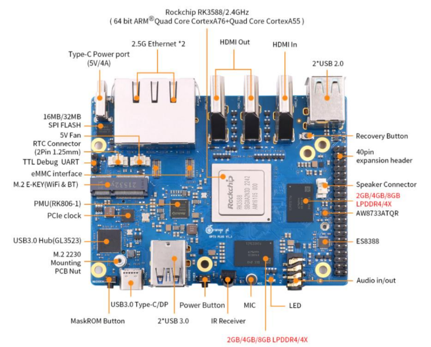

# Инструкция по запуску различных нейросетевых моделей семейства YOLO на NPU Rockchip (RKNN)

## 1. Настройка окружения на ПК Linux x86 (не одноплатный компьютер)

### Скачивание репозиториев для работы с RKNN

    # Create the 'Projects' folder
    mkdir Projects

    # Switch to this directory
    cd Projects

    # Download the RKNN-Toolkit2 repository
    git clone https://github.com/airockchip/rknn-toolkit2.git --depth 1

    # Download the RKNN Model Zoo repository
    git clone https://github.com/airockchip/rknn_model_zoo.git --depth 1

    # Скачивание этого репозитория (необходимо разрешение)
    git clone https://github.com/RazorvinAndrey/rknn_yolo.git

Структура каталога:

    Projects
    ├── rknn-toolkit2
    │ ├── doc
    │ ├── rknn-toolkit2
    │ │ ├── packages
    │ │ ├── docker
    │ │ └── ...
    │ ├── rknpu2
    │ │ ├── runtime
    │ │ └── ...
    │ └── ...
    ├── rknn_model_zoo
    | ├── datasets
    | ├── examples
    | └── ...
    └── rknn_yolo
      ├── media
      ├── models
      ├── yolo_6
      ├── yolo_8
      └── ...

### Установка виртуального окружения Conda

    wget -c https://github.com/conda-forge/miniforge/releases/latest/download/Miniforge3-Linux-x86_64.sh

После скачивания выполнить:

    chmod 777 Miniforge3-Linux-x86_64.sh
    bash Miniforge3-Linux-x86_64.sh
    source ~/miniforge3/bin/activate

После перезагрузки терминала по умолчанию будет запускаться окружение (base). Для дальнейшей работы создадим окружение с Python 3.8

    conda create -n toolkit2 python=3.8

После создания можно активировать его командой:

    conda activate toolkit2

### Установка RKNN-Toolkit2

Установка через pip:

    pip install rknn-toolkit2 -i https://pypi.org/simple

Установка через локальные пакеты из репозитория rknn-toolkit2:

    # Switch to the rknn-toolkit2 directory
    
    cd Projects/rknn-toolkit2/rknn-toolkit2

    # Please choose the appropriate requirements file based on the Python version and processor architecture:
    # where cpxx is the Python version

    pip install -r packages/x86_64/requirements_cpxx.txt

    # pip install -r packages/arm64/arm64_requirements_cpxx.txt

    # Install RKNN-Toolkit2

    # Please choose the appropriate wheel package file based on the Python version and processor architecture:
    # where x.x.x is the RKNN-Toolkit2 version number, cpxx is the Python version

    pip install packages/x86_64/rknn_toolkit2-x.x.x-cpxx-cpxx-manylinux_2_17_x86_64.manylinux2014_x86_64.whl

    # pip install packages/arm64/rknn_toolkit2-x.x.x-cpxx-cpxx-manylinux_2_17_aarch64.manylinux2014_aarch64.whl

После установки всех пакетов можно проверить:

    # Switch to Python interactive mode

    python

    # Import the RKNN class

    from rknn.api import RKNN

    exit()

## 2. Настройка окружения на одноплатном компьютере с NPU (в данном случае на Orange Pi 5 Plus rk3588)

Для начала работы нужно установить на одноплатный компьютер официальный образ системы, в данном случае это Ubuntu 22.04 LTS. Подробный мануал по установке системы разными способами описан [тут](https://drive.google.com/drive/folders/1Ov3mZqnMOf_8wpNt9rDxoGIR1ray2iiy).

Далее нужно установить пакетный менеджер Conda  на одноплатник: ( [вот источник](https://github.com/conda-forge/miniforge/tree/main) )

    curl -L -O "https://github.com/conda-forge/miniforge/releases/latest/download/Miniforge3-$(uname)-$(uname -m).sh"

    bash Miniforge3-$(uname)-$(uname -m).sh

    source "${HOME}/conda/etc/profile.d/conda.sh"

    conda init

    conda activate

Далее устанавливаем аналогично ПК пакеты в виртуальное окружение Conda:

    conda create -n toolkit2 python=3.8

    conda activate toolkit2

### Скачивание репозиториев для работы с RKNN

    # Create the 'Projects' folder
    mkdir Projects

    # Switch to this directory
    cd Projects

    # Download the RKNN-Toolkit2 repository
    git clone https://github.com/airockchip/rknn-toolkit2.git --depth 1

    # Download the RKNN Model Zoo repository
    git clone https://github.com/airockchip/rknn_model_zoo.git --depth 1

    # Скачивание этого репозитория (необходимо разрешение)
    git clone https://github.com/RazorvinAndrey/rknn_yolo.git

Структура каталога:

    Projects
    ├── rknn-toolkit2
    ├── rknn_model_zoo
    └── rknn_yolo

Для установки необходимых пакетов перейдем в папку:

    cd rknn-toolkit2/rknn-toolkit-lite2/packages

    pip install rknn_toolkit_lite2-2.3.2-cp38-cp38-manylinux_2_17_aarch64.manylinux2014_aarch64.whl

    cd Projects/rknn-toolkit2/rknn-toolkit2/packages/arm64

    pip install rknn_toolkit2-2.3.2-cp38-cp38-manylinux_2_17_aarch64.manylinux2014_aarch64.whl

После установки всех пакетов можно проверить:

    # Switch to Python interactive mode

    python

    # Import the RKNN class

    from rknn.api import RKNN

    exit()
    
### Установка драйвера для RKNPU2

Проверить какая версия драйвера установлена сейчас:

    dmesg | grep -i rknpu

С текущей версией с большей вероятностью пакеты rknn-toolkit2 работать не будут, поэтому рекомендуется обновить драйвер:

### Нужно заменить файлы в директории /bin и /lib на одноплатном компьютере.

Скопировать из директории Projects/rknn-toolkit2/rknpu2/runtime/Linux/rknn_server/aarch64/usr/bin все файлы:

    restart_rknn.sh
    rknn_server
    start_rknn.sh

в директорию /bin .

Скопировать из директории Projects/rknn-toolkit2/rknpu2/runtime/Linux/librknn_api/aarch64 файл:

    librknnrt.so

в директорию /lib .

Выдать разрешение на исполнение:

    # Grant executable permissions

    chmod +x /usr/bin/rknn_server

    chmod +x /usr/bin/start_rknn.sh

    chmod +x /usr/bin/restart_rknn.sh

    # Restart the rknn_server service

    restart_rknn.sh

## 3. Проверка работы моделей на базовых примерах на одноплатном компьютере с NPU (в данном случае на Orange Pi 5 Plus rk3588)

Для примера запустим базовую модель yolov5s_relu. Перейдем в папку примера и скачаем веса в формате ONNX:

    # Switch to the rknn_model_zoo/examples/yolov5/model directory

    cd Projects/rknn_model_zoo/examples/yolov5/model
    
    # Run the download_model.sh script to download the yolov5 ONNX model

    # For example, the downloaded ONNX model is stored at model/yolov5s_relu.onnx

    ./download_model.sh

Преобразуем веса в формат RKNN:

    # Switch to the rknn_model_zoo/examples/yolov5/python directory

    cd Projects/rknn_model_zoo/examples/yolov5/python

    # Run the convert.py script to convert the original ONNX model to RKNN format

    # Usage: python convert.py model_path [rk3566|rk3588|rk3562] [i8/fp] [output_path]

    python convert.py ../model/yolov5s_relu.onnx rk3588 i8 ../model/yolov5s_relu.rknn

На выходе получаем файл весов в формате .rknn . Данное преобразование можно делать как на персональном компьютере с Linux x86, так и на одноплатном компьютере. Для удобства проще это выполнять именно на ПК, так как после обучения собственной модели в формате .pt необходимо преобразовать её в формат .onnx. После чего сразу преобразовать в формат .rknn с квантизацией на том же датасете, по которому проходило обучение модели, подробнее об этом в следующем разделе.

Запустим пример детекции по фото:

    # Switch to the Projects/rknn_model_zoo/examples/yolov5/python directory

    cd Projects/rknn_model_zoo/examples/yolov5/python

    # Run the yolov5.py script to execute YOLOv5 model on the edge device
    # Usage: python yolov5.py --model_path {rknn_model} --target {target_platform} --img_show
    # If the --img_show parameter is included, the result image will be displayed
    # Note: Here, the example is for the rk3588 platform. if using a different board, modify the platform type in the command
    accordingly

    python yolov5.py --model_path ../model/yolov5s_relu.rknn --target rk3588 --img_show

    # If you want to run the original onnx model on the computer first, you can use the following command
    # Usage: python yolov5.py --model_path {onnx_model} --img_show

    python yolov5.py --model_path ../model/yolov5s_relu.onnx --img_show

## 4.  Преобразование собственных моделей YOLO для запуска на NPU Rockchip (Orange Pi 5 Plus rk3588)

После обучения моделей YOLOv5, v8, v11 и получения весов в формате .pt (PyTorch) необходимо преобразовать модель сначала в ONNX формат и далее с квантизацией в int8 (i8) в формат RKNN.

### Способ преобзования моделей YOLO на ПК Linux x86

Создадим виртуальное окружение для преобразований:

    conda create -n yolo_convert python=3.10

    conda activate yolo_convert

Рассмотрим на примере конвертации весов YOLOv8n.pt

Скачаем репозиторий [yolov8](https://github.com/airockchip/ultralytics_yolov8) 

    git clone https://github.com/airockchip/ultralytics_yolov8.git

    pip install onnx onnxruntime opencv-python

Далее нужно перейти в скаченную директорию и изменить файл ultralytics_yolov8/ultralytics/cfg/default.yaml

    # Train settings -------------------------------------------------------------------------------------------------------
    model: yolov8n.pt # (str, optional) path to model file, i.e. yolov8n.pt, yolov8n.yaml
    data: # (str, optional) path to data file, i.e. coco8.yaml
    epochs: 100 # (int) number of epochs to train for
    time: # (float, optional) number of hours to train for, overrides epochs if supplied
    patience: 100 # (int) epochs to wait for no observable improvement for early stopping of training
    batch: 16 # (int) number of images per batch (-1 for AutoBatch)
    imgsz: 640 # (int | list) input images size as int for train and val modes, or list[h,w] for predict and export modes
    save: True # (bool) save train checkpoints and predict results
    save_period: -1 # (int) Save checkpoint every x epochs (disabled if < 1)
    cache: False # (bool) True/ram, disk or False. Use cache for data loading
    device: # (int | str | list, optional) device to run on, i.e. cuda device=0 or device=0,1,2,3 or device=cpu
    ...

После этого можно запустить скрипт конвертации модели из .pt в .onxx:

    cd ultralytics_yolov8

    python ./ultralytics/engine/exporter.py

после этого получаем модель в формате ONXX.
    

Для квантизации необходимо подготовить 100-200 фото того же размера, что и сама модель и сдлеать текстовый файл с путями до этих фото. Здесь использовались фото из датасета кастомной модели из папки /trane. 

    cd rknn_yolo/yolo_8/python

в файле rasmetka.py нужно указать путь до папки с изображениями:

    import os
    import cv2
    from tqdm import tqdm

    # Если нужно экспортировать модель с другими размерами изображений (не как в датасете), иначе None
    RESIZE_TO_IMGSZ = None # или None, если не нужно ресайзить

    IMG_PATH = "dt_1/train/images"
    files = os.listdir(IMG_PATH)

    with open("data_subset.txt", "w") as fd:
    for i in tqdm(files):
        print(os.path.join(IMG_PATH, i), file=fd)
        if RESIZE_TO_IMGSZ:
        img = cv2.imread(os.path.join(IMG_PATH, i))
        img = cv2.resize(img, (RESIZE_TO_IMGSZ, RESIZE_TO_IMGSZ))
        cv2.imwrite(os.path.join(IMG_PATH, i), img)

Далее запускаем этот скрипт и получаем текстовый документ с путями до фото:

    dt_1/train/images/Screenshot-from-2025-01-30-10-14-45_png.rf.95c46575b1722155f42849a213e43f73.jpg
    dt_1/train/images/Screenshot-from-2025-01-30-10-17-29-1_png.rf.c0f9b472c37105dc5611125c518ffb33.jpg
    dt_1/train/images/Screenshot-from-2025-01-30-10-16-23_png.rf.ca95f4b911995b3af6c7a5877182f7b4.jpg
    dt_1/train/images/Screenshot-from-2025-01-30-10-17-47_png.rf.12102a80f293e1061c71684fafc66580.jpg
    ...

Теперь можно конвертировать ONNX в RKNN:

    python convert.py best.onnx rk3588 i8

После этого, полученную модель best.rknn нужно перенести на одноплатник с NPU и запустить на примере фото или видео.